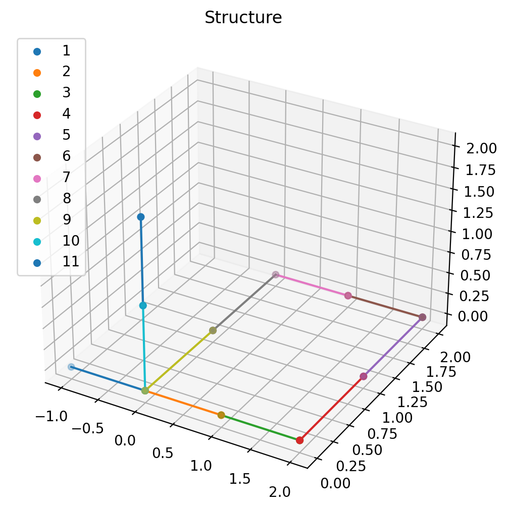

# To run the Jupyter Notebook locally

You will need jupyter lab, ipympl, and the gentk module.

### To install: 
```sh
conda install -c conda-forge ipympl
conda install -c conda-forge jupyterlab
pip install -i https://test.pypi.org/simple/ gentk
```

### To run the `test.00` project in this repository:
    ./bin/make_release test.00
    python3 release/test.00/server/gtkserver.py --port 8000

### Activate a jupyter Notebook in a different terminal:
    jupyter notebook

Use the GUI to navigate to the directory of your notebook "4DGB", go to  doc/examples/001/test00.ipynb

Run the entire notebook to view the 3D plot:

<div align="center">


</div>

