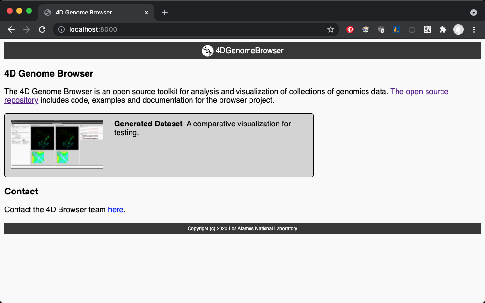
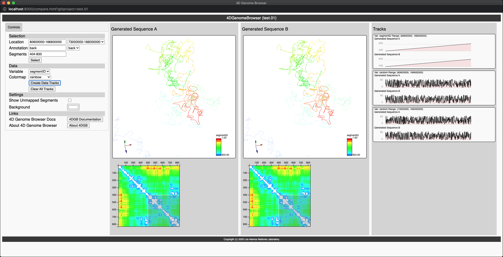

# 🧬 4D Genome Browser project 🧬


The 4D Genome Browser is a toolkit for querying and visualizing genomics data through the web. It consists of a few different components:

- A web server that responds to queries for data and serves either raw JSON data or webpages displaying visualizations of the data.
- A python library for making requests to such a server
- A Javascript browser library for visualizing data.

Data is formatted into "projects". A project consists of all of the input data files and a `project.json` file describing the files along with settings for viewing them. A project can then be "compiled", having all of its data incorporated into an SQLite database. This database is what the web server queries to serve data. A "release" of a project consists of a copy of the server code, the projectg directory, the project database, static files (including a minified version of the javascript library) along with a copy of the python library for querying the server.

## To set up

Initialize Python and npm:
```sh
# Create a python virtual environment
python3 -m venv venv/
source venv/bin/activate
pip3 install -r requirements.txt

# Init npm
npm install
```

## To run the application locally

- Make a release, then run the release server:
```sh
./bin/make_release <project>
```
- Execute the testing server in a release directory
```sh
python3 release/<project>/server/gtkserver.py --port 8000
```

For example, to run the `test.01` project in this repository:

```sh
./bin/make_release test.01
python3 release/test.01/server/gtkserver.py --port 8000
```

From there, open a web browser to `localhost:8000` to view the project page:

<div align="center">
</img>
</div>

Clicking on the grey zone or the image of the app will take you to the running instance:
<div align="center">
</img>
</div>

## To run a public instance

See the [Deployment Guide](doc/deployment.md)
